# Tikpilot

**English** · [Русский](README.ru.md)

[](https://github.com/maximdr86/tikpilot/actions/workflows/tests.yml)
[](LICENSE)
[](https://www.python.org/)

A web panel for managing a MikroTik fleet over the RouterOS API. Built for
50 devices and up.

Runs on any server with Python, as a single process. No Redis, no Celery, no
Node.js, no frontend build step. The panel itself needs no internet access:
nothing is loaded from third-party sites.

The interface comes in English and Russian, switchable from the menu.

> **The code was written by Claude, an AI model by Anthropic.** See
> [How this project came about](#how-this-project-came-about).

> The prompt and the project context behind it: [docs/prompt-mikrotik-panel.en.md](docs/prompt-mikrotik-panel.en.md).


**Site: [tikpilot.ru](https://tikpilot.ru)**

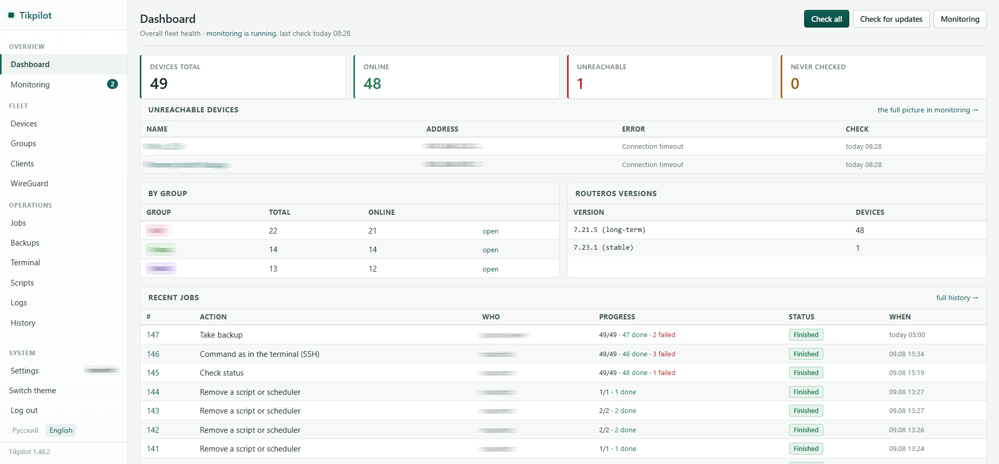

| | |
|---|---|
| 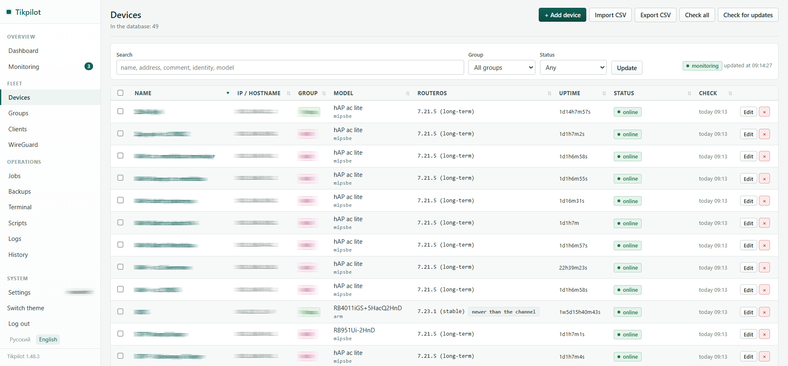 | 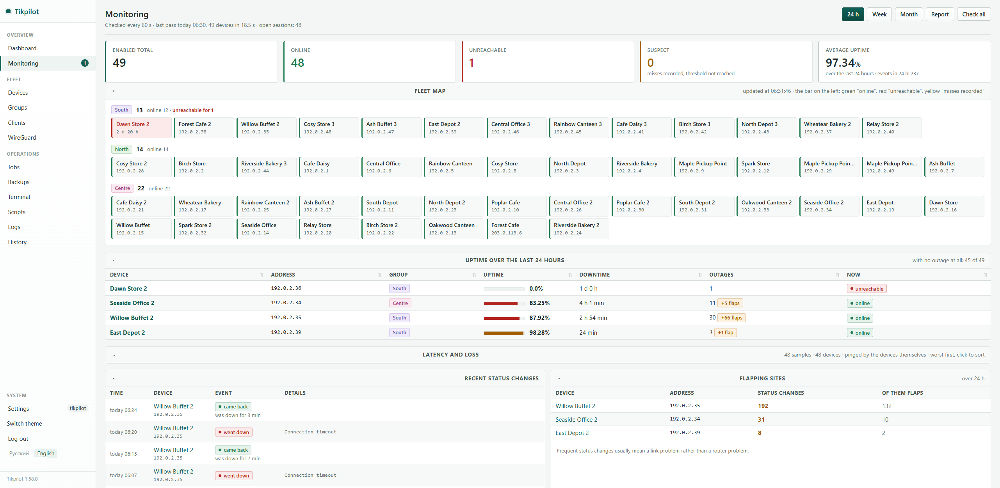 |
| **Devices.** Filters, search, sorting, RouterOS version, uptime and mobile operator for each site | **Monitoring.** Fleet map, uptime over 24 h, latency and loss |
| 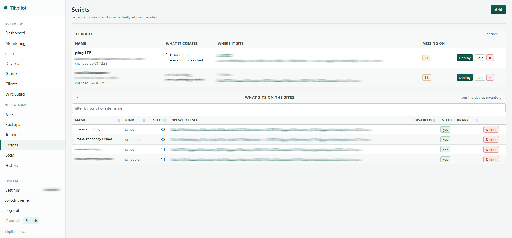 | 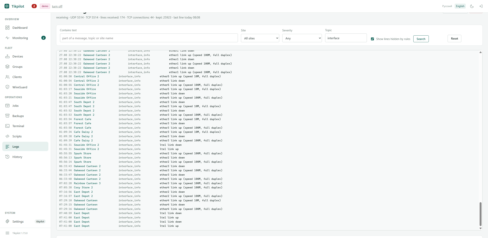 |
| **Scripts.** A library of commands and what actually sits on the routers | **Device log.** Syslog from the whole fleet, with filters and hiding rules |
| 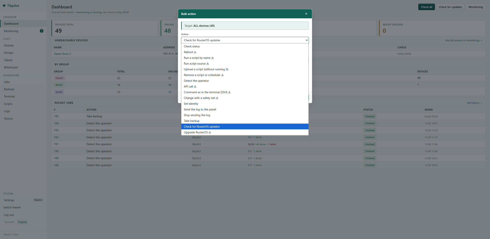 | 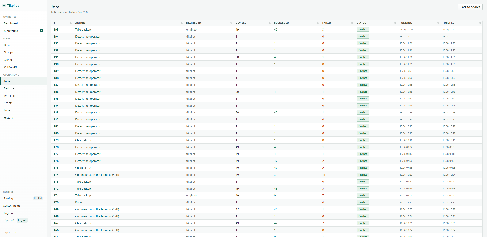 |
| **One action for the whole fleet.** Reboot, upgrade, a script, a backup, an API call | **Jobs.** History with per-device success and failure counts |
| 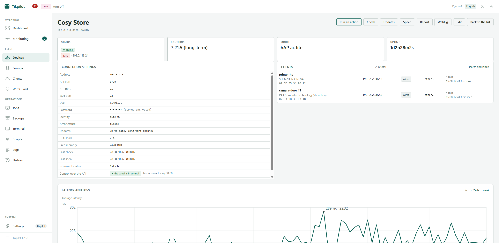 | 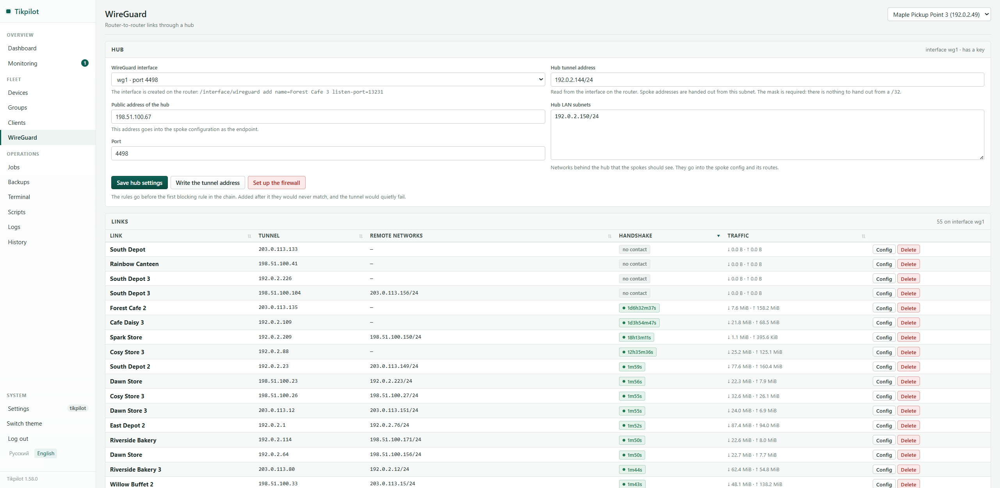 |
| **Device card.** Status, clients behind the router, latency and loss | **WireGuard.** Router-to-router links through a hub, with handshakes and traffic |

<details>
<summary>More screenshots: clients, backups, groups, audit log, rights, ports and services</summary>

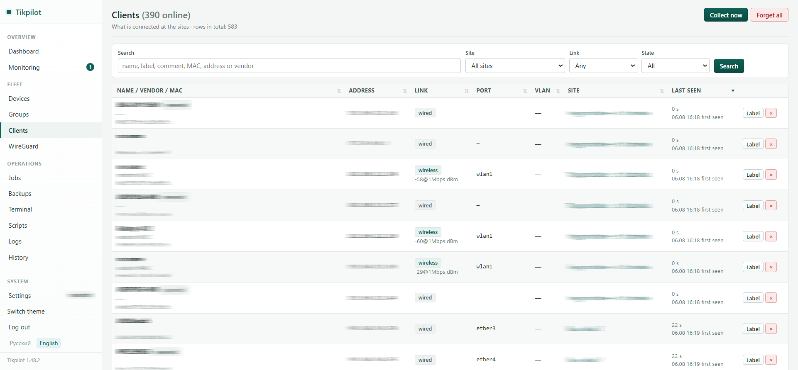
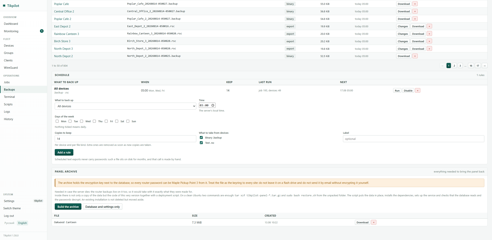
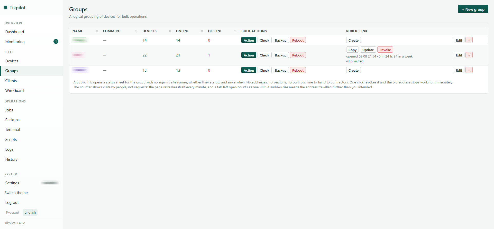
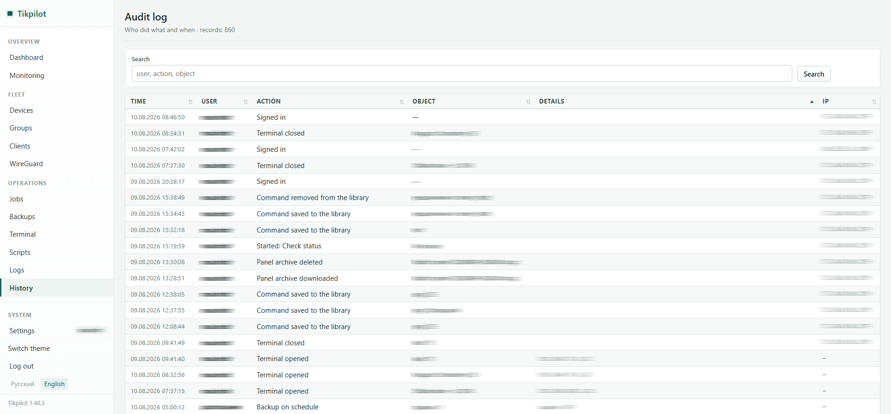
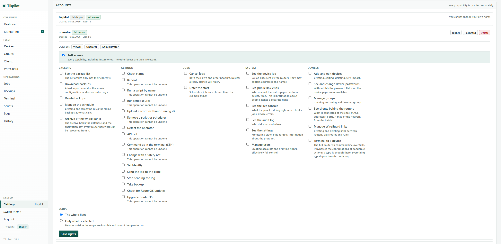
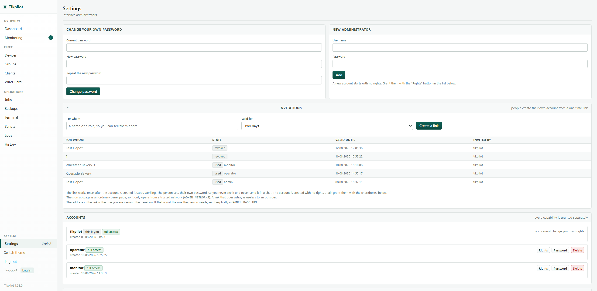
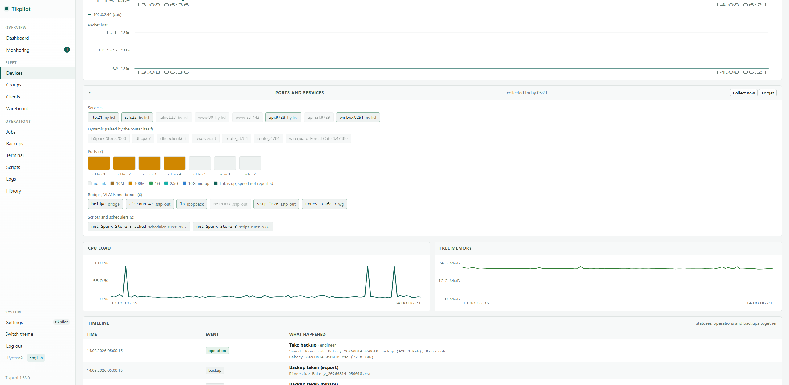
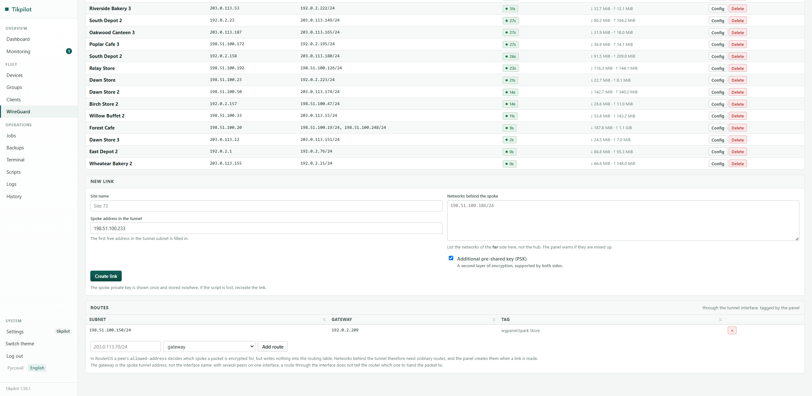

</details>

*The screenshots are taken from a live fleet with screenshot mode on: site names,
addresses, client names and accounts are replaced with made-up ones by the panel
itself. Addresses come from the ranges reserved for documentation.*

---

## What it does

**Device list.** Name, address, group, RouterOS version, uptime, status, time of
the last check. Filters, search, sorting by any column. Add devices by hand or
load a CSV file.

**Bulk operations.** Pick devices or a whole group and run:

* a status check;
* a reboot;
* a script that already sits on the device;
* pasted script source;
* a script upload without running it;
* any RouterOS API command;
* a command in console syntax over SSH, exactly as in Winbox, with wrapped
  lines joined back and the current menu remembered;
* the same with a safety net: the router rolls back to its previous
  configuration unless the change is confirmed;
* a backup (binary and export) downloaded to the server;
* setting the identity;
* a RouterOS upgrade.

Everything runs in the background. You see the progress and a separate result
for each device. A job can be cancelled, or deferred to a chosen time such as
02:00.

**Monitoring.** The panel checks availability once a minute and keeps a history
of outages with downtime totals. It shows a fleet map, uptime percentage over a
day, a week or a month, and a separate list of sites that keep flapping.

Short drops are told apart from real outages by `MONITOR_MIN_OUTAGE`: they are
marked as flaps, kept out of the downtime figure and out of the feed, but still
visible as a separate count.

**Link latency.** The devices ping the configured targets and their own gateway
themselves. The graphs show a link degrading before the site actually drops.

**Clients.** What is connected at the sites: name, vendor, MAC, address, port,
VLAN and when it was last seen. Built from DHCP leases, ARP and the bridge host
table, so it also shows boxes with hand-set addresses and which port the cable
is in. You can see whether a client is wired or wireless, and for wireless ones
also the network and the signal level. A comment set on the router itself is
shown as the name.

**Backups.** Files are stored on the server, searchable and downloadable.

**Console.** A tab showing what the panel is doing right now: checks, jobs,
device errors. Lines live in memory, and passwords never reach them.

**Device inventory.** The device card shows ports as tiles coloured by link
speed and marked where PoE is on, bridges and VLANs, neighbours from the
discovery table, the router's enabled services, and sensor readings. A
neighbour that also lives in the panel becomes a link to its own card.

Services deserve a separate mention: telnet, ftp, www without ssl, or api with
no address restriction are flagged as risky. One forgotten site with telnet
open is a hole, and you cannot find it by eye across fifty boxes.

Collected during the full poll, in the same session, and rendered from the
database: the card opens instantly and still works when the site is down.

**Device logs.** The panel receives syslog over UDP and TCP itself and keeps
the lines next to everything else: a line is tied to its site right away, and
you can jump from it to that device. Filters by text, site, severity and topic,
a live feed that loads older lines as you scroll, and a text export.

Rules decide what happens to a line: highlight it, hide it (still in the
database, brought back by a checkbox), or do not store it at all. The second is
for what irritates the eye, the third for what is not worth keeping. The panel's
own API logins come with a ready made hide rule, switched off.

**Audit log.** Who did what and when.

**Security.** Login and password to get in. Administrator passwords are hashed
(bcrypt), device passwords are encrypted (Fernet). After a few failed login
attempts the address gets a pause that grows with every excess.

---

## What you need to run it

The numbers are measured on a live install with 50 devices, not estimated.

| Resource | Minimum | Recommended |
|---|---|---|
| CPU | 1 core | 2 cores |
| RAM | 512 MB | 1 GB |
| Disk | 2 GB | 10 GB and up if you keep backups |
| Python | 3.10 | 3.12 |
| OS | anything with systemd | Ubuntu 22.04 or 24.04 LTS |

The panel uses 57 MiB of memory at startup and 62 MiB with fifty devices. The
install including the virtualenv takes 72 MiB. The database grows by about
1.6 MiB per day and then stops: old rows are pruned automatically.

Backups take the most space. A hAP ac lite copy is 80 to 150 KiB, a text export
15 to 60 KiB. For 49 sites that is roughly 67 MiB for seven daily copies.

A VM with one core and one gigabyte of RAM is plenty. The bottleneck is not the
server, it is the links to the sites.

---

## Installing

### Docker

```bash
git clone https://github.com/maximdr86/tikpilot.git && cd tikpilot
cp .env.example .env
docker compose up -d --build
```

The panel opens at `http://your-server:8080`. Login `admin`, password `admin`,
change it right after the first login.

**Settings live in `.env` next to `docker-compose.yml`, on the host, not inside
the container.** The image does not contain `.env` at all: the values are passed
in as environment variables at start. Edit the file and apply:

```bash
nano .env
docker compose up -d
```

No rebuild is needed for that, `--build` is only for code changes. To check what
actually arrived: `docker compose exec tikpilot env | sort`.

The published port is the left side of `ports`, for example `"6060:8080"`. There
is no reason to change the inner one.

### Ubuntu as a service

This is the way to go on a production server. Copy the project folder and run:

```bash
cd ~/tikpilot
sudo bash install-ubuntu.sh
```

The script installs the dependencies, creates a system user, deploys the panel
to `/opt/tikpilot`, sets up autostart and prints the address and the password.

The same script works as an updater. Replace the files, run it again: the
database, the keys and `.env` stay where they are.

Managing the service:

```bash
sudo systemctl status tikpilot
sudo systemctl restart tikpilot
sudo journalctl -u tikpilot -f
```

The installer, `restore-data.sh` and `run.sh` speak English or Russian
depending on the server locale. Force one with `TIKPILOT_LANG=en` or
`TIKPILOT_LANG=ru`:

```bash
sudo TIKPILOT_LANG=ru bash install-ubuntu.sh
```

> **Upgrading from ROSmanager?** The project used to be called that, and the
> name collided with an existing one. Run `sudo bash migrate-from-rosmanager.sh`
> to move a running install over without losing data. A local copy needs nothing:
> the old `rosmanager.db` is picked up and renamed on the first start.

### Windows, or just to try it out

```bash
git clone https://github.com/maximdr86/tikpilot.git && cd tikpilot
cp .env.example .env
./run.sh
```

On Windows run `run.bat`. The script creates the environment and installs the
dependencies itself.

Python 3.10 or newer is required. Tested on 3.10 and on 3.14.

> `requirements.txt` uses lower bounds rather than pinned versions, on purpose.
> Prebuilt packages for a brand new Python release may not exist yet, and then
> pip tries to compile them from source, which needs Rust and a C++ toolchain.
> With floating versions it always finds a ready-made wheel.

---

## Setting up the MikroTik devices

Each device needs the API enabled and a dedicated user. Run this on the router:

```rsc
# 1. Enable the API
/ip service set api disabled=no port=8728
# optionally restrict it to the server address:
/ip service set api address=192.0.2.10/32

# 2. FTP is only needed to download backups
/ip service set ftp disabled=no address=192.0.2.10/32

# 3. A group with minimal rights
/user group add name=tikpilot policy=api,read,write,test,ftp,reboot,policy

# 4. The user
/user add name=tikpilot group=tikpilot password="StrongPassword" address=192.0.2.10/32
```

What each policy is for:

| Policy | Why |
|---|---|
| `api` | required, nothing works without it |
| `read` | status, version, uptime |
| `write` | configuration changes, creating scripts |
| `test` | running scripts |
| `ftp` | downloading backups |
| `reboot` | mass reboot |
| `policy` | needed for scripts that carry policies |

Do not grant `sensitive` unless you need an export containing passwords.

If you do not need reboots and backups, `api,read,test` is enough.

The password must use Latin letters and digits. RouterOS does not accept
anything else over the API, and the panel says so up front.

If you want an encrypted channel, enable `api-ssl` on the router and tick
"use API-SSL" with port 8729 on the device page.

---

## Loading the device list

The easiest way to load a whole fleet: **Devices → Import CSV**.

```csv
name;host;username;password;group;comment
core-01;10.0.0.1;tikpilot;Secret123;Core;backbone
acc-01;10.0.1.10;tikpilot;Secret123;Access;entrance 1
```

Recognised columns: `name, host, username, password, api_port, ftp_port, group,
comment`. The delimiter (comma or semicolon) is detected automatically. Groups
that do not exist yet are created for you.

The `devices.csv` file in the project is a template with made-up data.

---

## Users and permissions

Every account has its own set of capabilities and its own scope. The model
follows MeshCentral: not roles, but checkboxes.

**Capabilities** are granted one by one: editing devices, managing groups,
viewing and downloading backups, the audit log, the settings, user management.
Every bulk action is a separate right of its own, so an operator can be allowed
to take backups and check status while reboots and RouterOS upgrades stay out
of reach. A newly added action appears in the list automatically.

**Scope** limits what the account sees to chosen groups and individual devices.
Everything outside is invisible: the device list, the dashboard, the fleet map,
the backups, even other people's job results. "Check all" means all of *their*
devices.

Roles survive as quick presets. Viewer, Operator and Administrator simply tick
a set of boxes, and you edit from there.

A new account starts with **no rights at all**. The opposite would be a nasty
surprise: an administrator adds someone "just to look" and that someone reboots
the fleet. You also cannot change your own rights, or one wrong click would lock
you out and the fix would be editing the database on the server.

Checks live on the server, not in the interface. A hidden button is a
convenience: a URL can be typed by hand and a request sent with curl.

### Password reset

Every other account in the list has a «Password» button: set a new one without
asking for the old. You cannot do this to yourself, there is a separate form
for that and it asks for the current password.

Changing a password, yours or someone else's, ends all of that person's
existing sessions: the session generation number moves and cookies issued
earlier stop matching. A password that leaves someone else's tab working
protects against nothing.

### Invitation links

Instead of inventing a password for someone and sending it in a chat, issue an
invitation under Settings. The person follows the link, picks a username and a
password of their own, and lands inside; you grant the rights afterwards.

The link works once and expires, by default after two days. The sign up page is
an ordinary panel page, so it only opens from a trusted network
(`ADMIN_NETWORKS`): a link that goes astray is useless to an outsider. An
existing username cannot be taken over, and the token never reaches the audit
log, which keeps only the note saying who the invitation was for.

The address in the link is the one you are viewing the panel on. If admins come
in on one address while you use another, set the right one in `PANEL_BASE_URL`.
Do not confuse it with `PUBLIC_BASE_URL`: that one faces outward for the status
page, and the sign up page will not open from outside anyway.

---

## Public status pages

Each group can have a link like `/status/<token>` that opens **without signing
in**. Hand it to contractors or the on-call shift: they see which sites are up,
which are down, and since when.

Alongside the current state it shows downtime over the last 24 hours, both per
site and as a total for the group. "How was it today" gets asked more often than
"how is it right now", and the figure is computed by the same code as in the
panel, so the contractor and the administrator look at the same number.

The page picks its language from the browser, and a link in the corner switches
it. The panel deliberately ignores the browser language; here it is the other
way round, because the link is opened by an outsider.

The page serves exactly that and nothing more. Deliberately absent: device
addresses (a list of internal IPs is a map of your network), RouterOS versions
(useful mainly to whoever plans to exploit them), error texts (they describe
your internals), and any other group.

The token is random and 32 characters long. The link is created and revoked
with a button under Groups, and revoking takes effect immediately. Turning it
back on always issues a new token.

### Who follows the link

**Logs → Public links** shows who opened a status page: address, device and
browser, when the session started and when it was last active. A block at the
top lists the pages that are open right now: the page refreshes itself once a
minute, and that trail shows live tabs.

A row is a session, not a request, so a tab left open all day stays one row
with a refresh counter. A link sent to a messenger is opened by the messenger
first to build a preview; those visits are marked as robots and hidden from the
list of people.

Visits with a token that does not exist are behind their own filter. One is a
typo, ten in a row from one address is someone guessing: revoke the link and
issue a new one. The wrong token itself is not stored, only its last six
characters.

This is information about people, so `visits.view` is a separate right that is
not granted by default, and retention has its own setting:

```
PUBLIC_VIEW_DAYS=90
```

The address in the link comes from `PUBLIC_BASE_URL`. Without it the server
only knows the address the request arrived on, and since the panel is opened
from the inside, the link would carry a local `10.x:8080`:

```
PUBLIC_BASE_URL=http://vpn.example.com:6060
```


The group list shows when each link was last opened and how many visits it
had over the last day and week. Visits count people, not requests: the page
refreshes itself every minute, so a tab left open counts once. A sudden rise
means the address travelled further than you intended.

The page is closed to search engines and to caching. An unknown token and a
revoked one answer identically, so guessing tells the visitor nothing.

---

## Site-to-site WireGuard

The WireGuard section sets up router-to-router links in a hub-and-spoke layout:
one router is the hub, the other sites connect to it.

Creating a link adds a peer and routes to the far side's networks on the hub,
and hands you a ready `.rsc` for the spoke router. If the spoke is already in
the device list, the script can be applied to it with one button. For non-MikroTik
peers a plain `wg-quick` config is offered too.

Everything created is tagged with a `wgpanel:<link>` comment, so deleting a link
touches only its own peer and routes; the rest of the router configuration is
left alone.

Hub settings are read from the router itself: the interface, the tunnel address
and the LAN subnets are filled in for you, so all that is left is to cross out
what does not belong and save.

It all runs over the same device API the panel already uses to manage the fleet.
No REST service, no certificate, no extra router user. The spoke private key is
shown once and stored nowhere.

For a phone or a laptop, a QR code is shown next to the `wg-quick` config. It is
drawn on the server, so no internet access is needed for it. An existing link
has no code: the private key is gone by then, and without it there is nothing to
put on the phone.

One thing worth knowing about routes: in RouterOS a peer's `allowed-address`
decides which spoke a packet is encrypted for, but writes nothing into the
routing table. Networks behind the tunnel therefore need ordinary routes, which
the panel creates for you.

Their gateway is the spoke tunnel address, `10.8.0.43` for example, not the
interface name. With a single peer there is no difference; with several, a route
through the interface does not tell the router which one to hand the packet to.

---

## Site operator

When a site goes down the first question is not "what is wrong with the router"
but "whose link is it". The device list has an "Operator" column, and search
covers it too.

The panel finds it on its own, in this order:

* **from the modem.** `/interface/lte/monitor` reports the network code, and the
  name comes from the code: `25001` is always MTS, while the string baked into
  the firmware differs from model to model. The technology and signal level are
  shown under the name;
* **from the address registry.** Where there is no modem, the panel asks RDAP
  about the public address of the site. This is the only place in the whole
  panel that reaches out to the internet, so it is off by default:
  `OPERATOR_LOOKUP=1`. Private and CGNAT addresses are never looked up: behind
  a carrier NAT the registry knows the owner of the NAT, not of the link;
* **by hand.** The "Operator" field on the device card. What you type there wins
  and is never overwritten by a poll; a contract number fits nicely there too.

Rechecked once a day: an operator changes approximately never.

---

## Monitoring

It works right after startup. Turn it off with `MONITOR_ENABLED=0`.

**The connection to a device is kept open.** The login happens once, and after
that a check is a short command inside the already open connection.

This is done because of two RouterOS behaviours.

First: every API login is written to the device log. With 50 sites checked once
a minute that is 70,000 entries a day. The router's internal log (100 lines by
default) is flushed within minutes, and when something actually breaks there is
nothing left to look at.

Second: a stream of short connections to port 8728 overflows the queue on
low-end devices, and they start writing `possible SYN flooding on tcp port 8728`.

A persistent session removes both problems. A new login only happens if the
connection really dropped.

**What is checked and how often:**

* every 60 seconds: is the device reachable;
* every 15 minutes: RouterOS version, uptime, CPU and memory load, pings.

Bulk actions use the same connection and need no new logins. The session is
closed only after operations that reboot the device.

**The "unreachable" status is set after three consecutive misses.** Sites behind
tunnels lose connectivity now and then. Without this delay the dashboard would
blink constantly and you would stop looking at it. Going back to "online" is
immediate, on the first reply.

Devices busy with a bulk job are skipped. If an upgrade is running and the site
is rebooting, a miss there is expected and is not recorded.

The number of open sessions and the total login count are shown in **Settings**.
Normally that is about one login per device per server start. Noticeably more
means the link to some sites keeps dropping.

If the links are really thin, raise `MONITOR_INTERVAL` and
`MONITOR_FULL_INTERVAL`.

---

## Latency and loss

The device pings the targets **itself**. This matters: pinging from the server
only shows the link to the site, while pinging from the site shows its own link
to the outside world.

Targets come from two places:

* the default gateway, which the panel detects on its own;
* the `LATENCY_TARGETS` list in `.env`, optionally with labels:
  `10.0.0.1=hub,8.8.8.8=internet`.

**What to pick as a target.** A central node that every site has a route to is
the best choice. That is exactly the path your production traffic takes. A
second target out on the internet helps tell where the problem is:

| What goes up | Where to look |
|---|---|
| the hub only | the tunnel or the hub side |
| both targets | the site's own link degraded |
| the internet only | the site's ISP has upstream trouble |

Each site can have its own targets set on its device page.

**Targets that never answer mute themselves.** ISPs often block ICMP to their
own gateway, and such a target always reports 100% loss. If there was no reply
at all across three checks, the panel stops polling it and retries once an hour.
In the summary these are listed separately so they do not get mixed up with real
link degradation.

If your gateways never answer anyway, turn them off entirely:
`LATENCY_PING_GATEWAY=0`.

Note that public addresses such as 8.8.8.8 rate-limit ICMP, so a few percent of
loss to them is normal. That is exactly why you want a target inside your own
network.

---

## Interface throughput

Latency and loss tell you about the state of the link, not who is using it up.
The panel computes speed from the **difference between byte counters** read on
two full polls: an average over the interval rather than the one second spike
`/interface/monitor-traffic` reports, and one command for every interface
instead of one per interface.

The uplink is watched by default. It is detected from the default route: in
RouterOS 7 from `immediate-gw`, which looks like `10.8.0.1%ether1`, in version 6
from `gateway-status`. The name is remembered on the device page.

Other interfaces are ticked on the device page, in the "Interface throughput"
section. That choice lives apart from the passport: the passport is rewritten on
every poll, the tick has to survive it.

A counter that went backwards is skipped rather than turned into a spike of
gigabits: a reboot, a recreated interface and a 32 bit counter wrapping in
RouterOS 6 all look the same, the new value being lower than the old one.

Switch it off with `TRAFFIC_ENABLED=0`; watch everything with
`TRAFFIC_ALL_INTERFACES=1` (on a box with thirty VLANs that means thirty rows in
the database instead of one).

---

## Thresholds and notifications

The panel shows everything, but nobody can watch it around the clock. A rule is
a metric, a comparison, a value and a **hold time**. The last one is what
matters: a spike of CPU during a nightly backup is not an event, half an hour at
the same level is.

You can measure what is collected anyway: how long a site has been unreachable,
CPU load, free memory, temperature, latency, loss, interface throughput and the
age of the last backup. Each rule has its own scope: the whole fleet, a group or
a single site.

A value that cannot be read counts as neither an alert nor a recovery. On a
board with no temperature sensor the rule "above 60" simply stays quiet.

**Useful rules to start with:**

| Rule | Why |
|---|---|
| site unreachable > 15 min | an outage rather than a flap |
| age of the last backup > 26 h | the backup did not happen and nobody would know |
| free memory < 16 MiB | it is about to start failing on memory |
| loss > 10 % for half an hour | the link degraded but the site is still up |

### Where it goes

Telegram. The message goes out as a **digest**: everything that
piled up in one message every `NOTIFY_DIGEST_MINUTES` minutes. Fifteen outages
are fifteen lines, not fifteen messages.

There are three limiters and all of them are on by default:

* the **digest** instead of a stream of events;
* **quiet hours** (`NOTIFY_QUIET_FROM`, `NOTIFY_QUIET_TO`): at night events pile
  up and go out in the morning, and the range may cross midnight;
* a **pause per rule and site** (`NOTIFY_COOLDOWN_MINUTES`), so one flapping site
  does not drown out the rest.

Telegram needs a bot token (from BotFather) and a chat id (any bot like
userinfobot will show it). The bot has to be added to the chat, otherwise it
cannot write there. The token is stored encrypted with the same key as the
router passwords and is never shown back. There is a test button next to it: a
mistyped chat id is otherwise discovered during the first real outage.

All of this is off until you turn it on (`NOTIFY_ENABLED=1`): the panel promises
to work in a network with no internet, and a request to api.telegram.org nobody
asked for would break that promise.

### Liveness signal

The panel cannot report its own death: a dead program sends nothing. So it does
the opposite - every few minutes it pings the address you set (`HEARTBEAT_URL`),
and whoever stops receiving the ping raises the alarm. healthchecks.io, your own
script or a cron job on another machine will all do. The watchdog should wait
noticeably longer than the interval, otherwise it fires on every restart.

---

## Upgrading RouterOS

The riskiest operation, which is why it is split into two steps.

### Step 1: find out the versions

**Dashboard → "Check for updates"**. Nothing is installed. The devices query the
MikroTik servers themselves and report which version is installed and which is
available. The result is stored: the list gets a `↑ 7.20.1` marker and the
filter gets an "update available" option.

The sites need access to `upgrade.mikrotik.com`.

### Step 2: upgrade

The **"Upgrade RouterOS"** button. For each device:

1. Updates are checked again. If the version is current, the device is not touched.
2. A backup is taken and downloaded to the server. If that fails, the upgrade is aborted.
3. The packages are downloaded to the device **without rebooting**. This is the
   longest step, and the device keeps working normally throughout.
4. A reboot, and a wait until the link actually disappears.
5. Waiting for it to come back, and checking that the version is the expected one.
6. Optionally a RouterBOOT bootloader upgrade and one more reboot.

> **Why the download is separated from the install.** The `install` command does
> both at once: it downloads the packages and immediately reboots. On a thin link
> the download takes minutes and the moment of reboot is unpredictable, since the
> device keeps answering the whole time. With the steps split, the panel knows
> exactly when the reboot started. And if the packages did not finish
> downloading, the site simply keeps running the old version.

Options:

| Option | Default | What it does |
|---|---|---|
| Update channel | `long-term` | written to the device before the check |
| Take a backup | on | without a backup the install does not start |
| Package download wait | 1800 s | set it higher on a thin link |
| Return wait | 420 s | 0 means do not wait and do not verify |
| Upgrade RouterBOOT | off | needs one more reboot |
| Batch size | 5 | 0 means all at once |
| Pause between batches | 120 s | time to spot a problem and hit "Cancel" |

**Advice for a production fleet.** Upgrade one non-critical site first, look at
the result, and only then run a group in batches.

### About downgrades

Switching the channel does not roll a version back. The typical case: the device
runs **7.23.1 stable**, the channel is switched to **long-term** where only
**7.21.5** is offered. That is older than what is installed.

The panel refuses such a job. The reasons are serious:

* the `install` command only goes forward, it simply ignores a downgrade;
* settings introduced in newer versions are not understood by the older one and
  get lost;
* a binary backup from 7.23.1 will not restore on 7.21.5, only the text `.rsc`.

In the list such a site is marked "newer than the channel". If you really need a
downgrade, do it by hand with `.npk` files or netinstall, one site at a time.

If you want to move the fleet to long-term, just switch the channel and wait.
Once that branch overtakes the installed version, the sites upgrade on their own.

### If there is not enough space

The panel does not check free space in advance. Only RouterOS knows how much is
needed, and it says so in the error with exact numbers:

> ERROR: not enough disk space, 7.3MiB is required and only 0.3MiB is free.

Any threshold we picked would be a guess. On devices with 16 MiB of storage
(hAP lite, hAP ac lite) less than two megabytes are free after RouterOS is
installed. A sensible-looking limit would have rejected all of them, even though
they upgrade fine.

If space really did run out: delete junk from the device (old `.npk` files and
backups in `/file`), install the update as separate packages, or reflash via
netinstall.

### If a site does not come back

Look at its device page first. Monitoring keeps watching after the job has
finished, so a late recovery shows up in the history.

If it never comes up, the upgrade most likely did not make it. RouterOS boots
the old version when the package is damaged, so a plain power cycle usually
helps.

For sites on really thin links, upgrade them as a separate job: download wait
3600 seconds, batch size 1.

---

## Script library

The **Scripts** page keeps two things side by side: command templates and what
actually sits on the routers.

**Library.** Name, note and the command text. While a long script lives in chat,
a month later you dig through the history, find three versions and cannot tell
which one is deployed.

**Marker.** An entry declares the script or scheduler name it creates (usually
detected from `/system script add name=...`). The panel counts deployment by
that name against the device inventory, not against its own job log. The
difference matters: the log says "we sent this there on Wednesday", the marker
answers the real question, "is it there now?".

**Deploying.** The «Deploy» button asks where to:

| Choice | What it does |
|---|---|
| Where it is missing | sites without the marker. The question that matters |
| To all sites | the whole fleet within your scope |
| To a group | one group |
| Pick sites manually | checkboxes |

Then the usual action dialog opens: same confirmations, same permissions, same
rollback insurance. There is deliberately no separate run path, otherwise half
of those safeguards would not apply.

The button says «Deploy», not «Run»: the commands install a script and a
scheduler, and it works on its own afterwards.

**What is on the routers.** A summary of everything found during inventory,
including scripts someone added by hand outside the panel. Site names sit right
in the row, long lists are cut to six. The filter above the table matches both
script names and site names, so it also answers the reverse question: what is
installed on this particular site. The data comes from the device inventory, so
a full poll is needed first.

**Removing.** The «Delete» button in a summary row removes the script or
scheduler from exactly the sites where it was found. You can remove both at
once: a scheduler is usually named differently from the script it calls, and
removing one half leaves the other calling nothing. A site without that entry
is not treated as a failure. This needs its own permission,
`action.remove_script`.

---

## Running scripts and timeouts

RouterOS does not reply until the script has finished. Scripts like AutoBackup
take longer than the normal timeout, which is why the "run script" actions have
a **"wait for completion, seconds"** option (120 by default). Be generous: while
waiting, the connection is simply held open and costs nothing.

If the reply never arrives, the result says so plainly:

> The device did not answer /system/script/run within 120 s.
> The command itself is most likely still running on the device.

This is **not** a lost connection. The device is reachable, the script is just
long. Execution on the device is not interrupted.

---

## Moving to another server

Everything worth keeping lives in the `data` folder: the database, the
encryption keys and the backups. Migrating means copying that folder.

**Stop the panel on the old machine first.** SQLite keeps part of the data in
separate files, and a copy of a running database can be incomplete.

```bash
# on the old machine
scp -r /path/to/project/data user@new-server:~/tikpilot-data

# on the new server
sudo bash /opt/tikpilot/restore-data.sh
```

The script finds the folder itself, validates it **before** touching anything,
and refuses to run if there is no database inside. The old data is not deleted
but moved aside to `data.bak-<date>`.

The main thing to check is that `data/fernet.key` is there. Without it the
device passwords cannot be decrypted: the list survives, but nothing will
connect. The script warns about this up front.

After a migration the login and password **from the old machine** apply.

To validate already migrated data separately:

```bash
sudo bash /opt/tikpilot/check-data.sh
```

---

## What changed in the configuration

Every text export has a Changes button: a comparison with the previous copy of
the same site. It is the first thing you want to see after an outage, and the
only way to notice someone else's edit, or your own forgotten one.

The export header is left out of the comparison. RouterOS writes the date and
version into the first line, so without that two identical configurations would
always differ.

---

## Searching configurations

The "Search configurations" button in the Backups section looks for a string
inside the latest exports of every site at once: where an old server address is
still set, which sites carry a rule you are about to change.

It searches the latest copy of each site, ignoring case. Sites that never had a
text export taken are not searched.

---

## Availability report

The "Report" button on the monitoring page opens a document ready to be handed
over: a summary in large figures, a bar chart of fleet availability by day (or
by hour for a one day window), the sites that need attention, a table of every
site, and a log of outages with the times they started and ended.

Above the document sits a scope form: a period or a date range, a group and, if
needed, individual sites by checkbox. Both dates are inclusive and counted from
local midnight; a date range wins over the period. Ticked sites win over the selected group. The chosen scope is
printed in the header and carried into the CSV together with its file name, so
a month later nobody has to guess what the figure covered. The selection can
only narrow what you are allowed to see: another group id in the address will
not bring foreign sites into the report. The form itself does not print.

It prints. `Ctrl+P` in the browser produces a PDF with page margins, without
the panel menu and without the dark theme; tables do not break across pages
mid-row. No new dependency was added for this: the chart is the same
server-rendered SVG used elsewhere, and the layout is plain CSS.

Put your organisation name in the header with `REPORT_TITLE` in `.env`.

The same numbers are still available as CSV, from the button inside the report
or directly at `/monitoring/report.csv`. That file opens in Excel as it is:
semicolon separator, comma as the decimal mark, BOM at the front.

Both respect scope: a contractor with two sites gets a report about two sites.

---

## Scheduled backups

The Backups section can take copies on its own. A rule says three things:
what to back up (the whole fleet, one group, or the panel archive), when
(time of day and days of the week), and how many copies to keep.

Extra copies are removed as soon as new ones are taken. Kinds are counted
separately: "keep 14" means 14 binary backups and 14 text exports per device,
not 14 files mixed together.

Scheduled text exports never carry passwords. Such a file sits on disk for
months, and putting passwords in it is a decision made by hand.

The time is the server's local time. The Run button next to a rule fires it
immediately: it is better to find out that a rule does what you meant right
away than at three in the morning.

---

## Backing up the panel itself

The "Build the archive" button in the Backups section puts the database, the
encryption key, `.env` and the device backups into a single file. The archive
carries a note with the restore steps inside.

It is meant for the day the server dies: router backups live on it too, so it
would take with it exactly what they were made for.

> **This is a dangerous file.** The encryption key sits next to the database,
> so every router password can be recovered from the archive in plain form.
> Treat it as the keyring to every site: do not leave it on a flash drive and
> do not send it by email without encrypting it yourself. The `panel.backup`
> right is granted separately from the other backup rights, and every build
> and download is written to the audit log.

The archive can be put on a schedule like ordinary backups.

The same thing by hand:

```bash
tar czf tikpilot-$(date +%F).tar.gz data/ .env
```

**Without `fernet.key` the device passwords cannot be recovered.**

---

## Settings (the `.env` file)

> Settings marked **panel** can also be changed in Settings → Working parameters,
> without editing this file or restarting. A value set there wins over the file.


| Variable | Default | What it sets |
|---|---|---|
| `DEFAULT_LANG` | `en` | interface language: `en` or `ru` |
| `ADMIN_USERNAME` / `ADMIN_PASSWORD` | `admin` / `admin` | the account created on first start |
| `SECRET_KEY` | generated | cookie signing |
| `FERNET_KEY` | generated | device password encryption |
| `DATA_DIR` | `./data` | where the database, keys and backups live |
| `HOST` / `PORT` | `0.0.0.0` / `8080` | listen address and port |
| `MAX_WORKERS` | `12` | how many devices are processed at once |
| `API_TIMEOUT` | `10` | RouterOS API timeout, seconds |
| `FTP_TIMEOUT` | `30` | backup download timeout, seconds |
| `MONITOR_ENABLED` | `1` | availability monitoring |
| `MONITOR_INTERVAL` | `60` | how often to check the link, seconds |
| `MONITOR_FULL_INTERVAL` | `900` | how often to poll in detail, seconds |
| `MONITOR_FAIL_THRESHOLD` | `3` | misses before the "unreachable" status |
| `MONITOR_WORKERS` | `0` | concurrent checks (0 means same as `MAX_WORKERS`) |
| `MONITOR_EVENT_RETENTION_DAYS` | `30` | how long to keep the outage history |
| `LATENCY_ENABLED` | `1` | latency and loss measurement |
| `LATENCY_TARGETS` | `8.8.8.8` | shared ping targets, comma-separated |
| `LATENCY_PING_GATEWAY` | `1` | also ping each site's gateway |
| `LATENCY_COUNT` | `5` | packets per measurement |
| `METRICS_RETENTION_DAYS` | `14` | how long to keep the graphs |
| `VENDORS_AUTO_UPDATE` | `1` | refresh the MAC vendor database from IEEE once a month |
| `UI_REFRESH_INTERVAL` | `15` | how often the page refreshes itself, seconds |
| `SESSION_MAX_AGE` | `43200` | session lifetime, seconds |
| `SESSION_REMEMBER_AGE` | `2592000` | session lifetime with "Remember me" ticked, seconds |
| `JOB_RETENTION_DAYS` | `90` | how long to keep the job history |
| `ADMIN_NETWORKS` | empty | networks allowed to reach the panel (the status page stays public) |
| `TRUSTED_PROXIES` | `127.0.0.1,::1` | proxies whose `X-Forwarded-For` may be trusted |
| `COOKIE_SECURE` | `0` | set to `1` when running behind HTTPS |

About `MAX_WORKERS`: 12 threads is fine for 50 to 200 devices. For fleets in the
thousands, raise it to 30 or 50, watching your link and server CPU.

---

## Reaching the panel from outside

A public status link means the port has to be reachable from the internet, and
the same port also serves the panel's sign-in form. One setting in `.env` keeps
them apart:

```
ADMIN_NETWORKS=10.0.0.0/8,192.168.0.0/16
```

`/status/<token>` and its stylesheet stay open to everyone; everything else
answers 403 for requests from other addresses. An empty value means no
restriction.

Behind a reverse proxy the real address arrives in `X-Forwarded-For`, which
anyone can forge with a single curl flag. The header is therefore trusted only
when the request came from a proxy listed in `TRUSTED_PROXIES` (localhost by
default), and the address taken from the chain is the one closest to us.

---

## Running behind HTTPS

The panel listens on plain HTTP and expects to sit behind a reverse proxy. An
nginx example:

```nginx
server {
    listen 443 ssl http2;
    server_name tikpilot.example.com;

    ssl_certificate     /etc/letsencrypt/live/tikpilot.example.com/fullchain.pem;
    ssl_certificate_key /etc/letsencrypt/live/tikpilot.example.com/privkey.pem;

    location / {
        proxy_pass         http://127.0.0.1:8080;
        proxy_set_header   Host              $host;
        proxy_set_header   X-Real-IP         $remote_addr;
        proxy_set_header   X-Forwarded-For   $proxy_add_x_forwarded_for;
        proxy_set_header   X-Forwarded-Proto $scheme;
        proxy_read_timeout 300s;
    }
}
```

And set `COOKIE_SECURE=1` in `.env`.

---

## If something does not work

| What you see | What to check |
|---|---|
| Connection refused | `/ip service print`: is `api` enabled, is the port right, is `address=` in the way |
| Invalid username or password | the user's password and the `api` policy on its group |
| Connection timeout | host reachability, a firewall on the path. You can raise `API_TIMEOUT` |
| Did not answer within N s | the command is long, usually a script. Raise "wait for completion". The device is reachable |
| RouterOS rejected the command | the user lacks a policy (`write`, `test`, `policy`, `reboot`) |
| FTP: download failed | is the `ftp` service on, does the user have the `ftp` policy, is port 21 reachable |
| The backup file never appeared | not enough space on the device (`/system/resource print`) |
| Every device went offline after changing `FERNET_KEY` | the passwords are encrypted with the old key. Restore `data/fernet.key` or re-enter the passwords |

Logs: `journalctl -u tikpilot -f` or `docker compose logs -f tikpilot`.

---

## Interface language

The switcher is at the bottom of the sidebar. The choice is stored per
administrator and survives logging in from another machine.

`DEFAULT_LANG` in `.env` decides what someone sees before they touch the
switcher. It ships as `en`.

**Adding your own language** means copying `app/locales/en.json` to a file named
after your language code and translating the values. The keys are the original
Russian strings, so the file reads like a plain dictionary.

A few rules for the translator:

* `%(p0)s` and similar are substitutions. Move them wherever your grammar wants
  them, just do not lose any;
* tags such as `<code>` and `<strong>` inside a string must be kept, only the
  words between them are translated;
* keys containing `|` are plural forms. Russian has three, English has two;
* the `__patterns__` section holds rules for messages assembled at runtime, for
  example with a number of seconds inside.

---

## How the code is organised

```
app/
├── main.py          application startup
├── config.py        settings from .env
├── database.py      SQLite schema and data access
├── crypto.py        password encryption
├── auth.py          login and sessions
├── mikrotik.py      RouterOS API and FTP
├── actions.py       the list of bulk actions, new ones go here
├── worker.py        background job execution
├── monitor.py       availability monitoring
├── sessions.py      persistent connections to devices
├── i18n.py          interface translations
├── charts.py        chart rendering
├── locales/         translation files
└── routes/          pages and API
templates/           page templates
static/              styles and scripts
data/                database, keys, backups (not in the repository)
```

**How jobs are executed.** A bulk action creates a row in the `jobs` table and
one row per device. A separate thread picks jobs up and spreads the devices
across a thread pool. Progress is written to the database, so it is visible to
every administrator and survives a page reload. No Redis, no Celery.

**How translations work.** The templates contain plain Russian text and nothing
is wrapped by hand. A Jinja2 extension finds the text when the template is
compiled and marks it automatically. Forgetting to translate a new button is
impossible: the `test_every_interface_string_is_translated` test rejects any
string with no English counterpart.

---

## Adding your own bulk action

Everything happens in one file, `app/actions.py`. The interface, the parameter
form and the execution are picked up automatically; no templates or JS to edit.

```python
@register(
    name="disable_wifi",                       # internal name
    label="Выключить Wi-Fi",                   # what the operator sees
    description="Отключает все беспроводные интерфейсы",
    dangerous=True,                            # asks for confirmation
    params=[
        ActionParam("band", "Диапазон", "select",
                    options=[("all", "Все"), ("2ghz", "2.4 ГГц"), ("5ghz", "5 ГГц")]),
    ],
)
def act_disable_wifi(mt, device, params):
    """mt is an open connection, device a database row, params the form values."""
    for iface in mt.cmd("/interface/wireless/print"):
        mt.cmd("/interface/wireless/set", **{".id": iface[".id"], "disabled": "yes"})
    return "Wi-Fi выключен"          # this text lands in the job result
```

What you get inside:

* `mt.cmd("/command/path", **args)` returns a list of replies;
* `mt.cmd_fire_and_forget(...)` for commands that kill the connection (reboot);
* `mt.download_via_ftp(name, path)` fetches a file from the device;
* `raise DeviceError("text")` marks the device as failed with a readable message.

Unhandled exceptions are caught too, so one device cannot take the whole job
down.

Field types: `text`, `password`, `textarea`, `checkbox`, `select`.

Labels are written in Russian and translated through `app/locales/en.json`, so
add the English strings there.

---

## Tests

No real router needed. `tests/fake_router.py` holds a stub that speaks the real
RouterOS API protocol and can serve files over FTP.

```bash
pip install -r requirements-dev.txt
DATA_DIR=/tmp/tikpilot-test MONITOR_ENABLED=0 pytest -q
```

Covered: password encryption, login and access control, rendering of every page,
talking to a device, the full backup cycle, CSV import, migration of an older
database, translation completeness, and the whole RouterOS upgrade scenario
including the refusal to downgrade and batching.

There is also a test that monitoring does not multiply connections: ten checks
in a row must cost exactly one connection and one login, and a whole bulk action
must cost none.

---

## Changelog

What changed between versions: [CHANGELOG.md](CHANGELOG.md).

The current version is shown at the bottom of the sidebar and under
**Settings → About**, together with the database path. That helps when several
copies of the project sit next to each other.

---

## How this project came about

The code in this repository was written by **Claude**, Anthropic's AI model,
across a series of conversations. Not as autocomplete for a programmer: the
model wrote the modules, the tests and this documentation.

The other half of the work belongs to [maximdr86](https://github.com/maximdr86),
a network administrator. He set the task and the requirements, ran every version
on a live fleet of 49 MikroTik devices behind WireGuard tunnels, and reported
what broke. Most of the entries in [CHANGELOG.md](CHANGELOG.md) exist because
something misbehaved on real hardware, not because it looked wrong in review.

Several design decisions came directly from that. Monitoring keeps a persistent
API session because the first version filled the routers' logs and triggered
`possible SYN flooding` warnings. The download step is separated from the install
because a site on a thin link failed to come back after an upgrade. The free
space check was removed before an upgrade because it would have rejected the
entire hAP ac lite fleet, which upgrades perfectly well.

**What this means for you.** Nobody has reviewed every line by hand. What exists
instead is a test suite of 106 tests running against a stub that speaks the real
RouterOS API protocol, and a fleet of 49 devices this has been managing in
production. The panel can reboot and upgrade your routers, so try it on one
non-critical device first. That advice would hold for any tool of this kind.

---

## Contributing

Bug reports and ideas go to Issues, where there are templates. How to set up the
environment and what to check before a pull request: [CONTRIBUTING.md](CONTRIBUTING.md).

Please report security issues via [SECURITY.md](SECURITY.md) rather than a
public issue.

---

## License

[MIT](LICENSE). Use it, modify it, embed it. No warranty of any kind.
